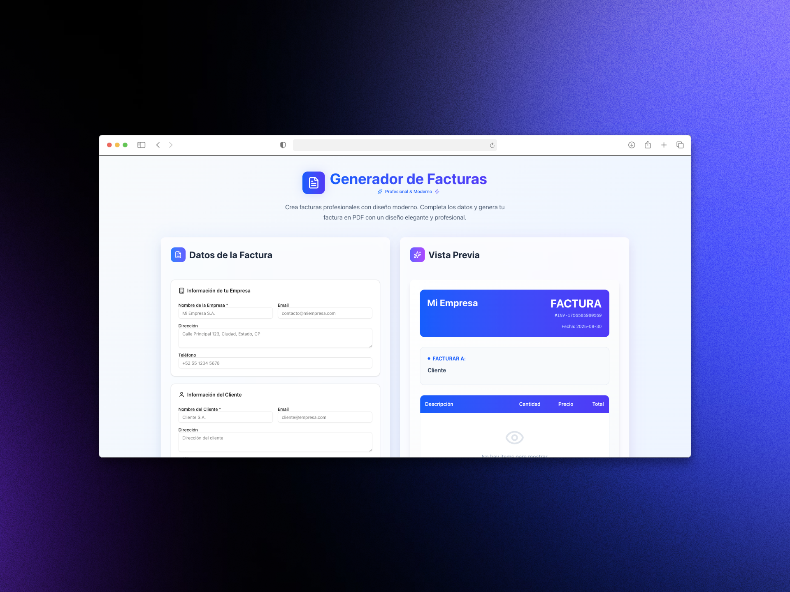

# Generador de Facturas Profesional



Crea facturas profesionales con **diseño moderno** y descárgalas en PDF. Ideal para **freelancers y pequeñas empresas** que quieren ahorrar tiempo y dar una imagen profesional.  

✨ **Gratis y Open Source**  

---

## Tecnologías utilizadas

- ⚛️ **React**  
- 🟦 **Next.js**  
- 🖌 **ShadCN UI** para diseño moderno y elegante  
- 📄 **Generación de PDFs dinámicos**  

---

## Características principales

- 🏢 Información de empresa y cliente editable.  
- 📝 Agrega productos o servicios con cantidades y precios.  
- 📄 Vista previa en tiempo real de la factura.  
- 💾 Descarga en PDF profesional y lista para enviar.  

---

## Cómo usarlo

1. Clona el repositorio:  
```bash
git clone https://github.com/<usuario>/<repositorio>.git
cd <repositorio>
